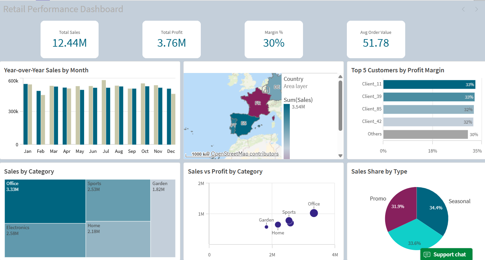
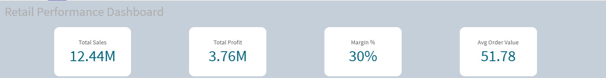
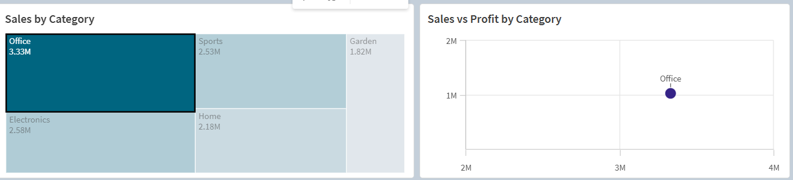

# Retail Performance Dashboard (Qlik Sense)

## Overview
Interactive dashboard developed in Qlik Sense to analyze sales performance across regions, categories, and customers.

## Data
Synthetic dataset created for portfolio purposes.

## Key Features
- KPI overview (Total Sales, Profit, Margin %, Avg Order Value)
- Year-over-Year sales analysis
- Sales by category
- Top customers by profit margin
- Geographic sales performance
- Sales vs Profit analysis

## Business Value
This dashboard helps stakeholders understand sales trends, identify top-performing categories and customers, and support data-driven decision making.

## Tools
- Qlik Sense

## Purpose
Portfolio project demonstrating business intelligence and data visualization skills.

## Results
- Identified top-performing product categories
- Highlighted key customers contributing to profit
- Provided insights into sales trends and seasonal patterns
